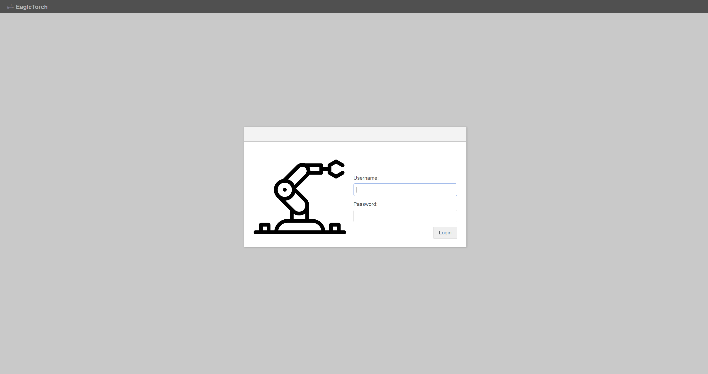
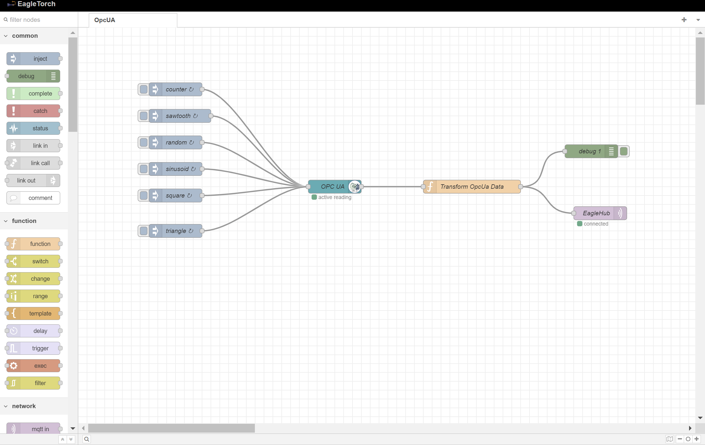
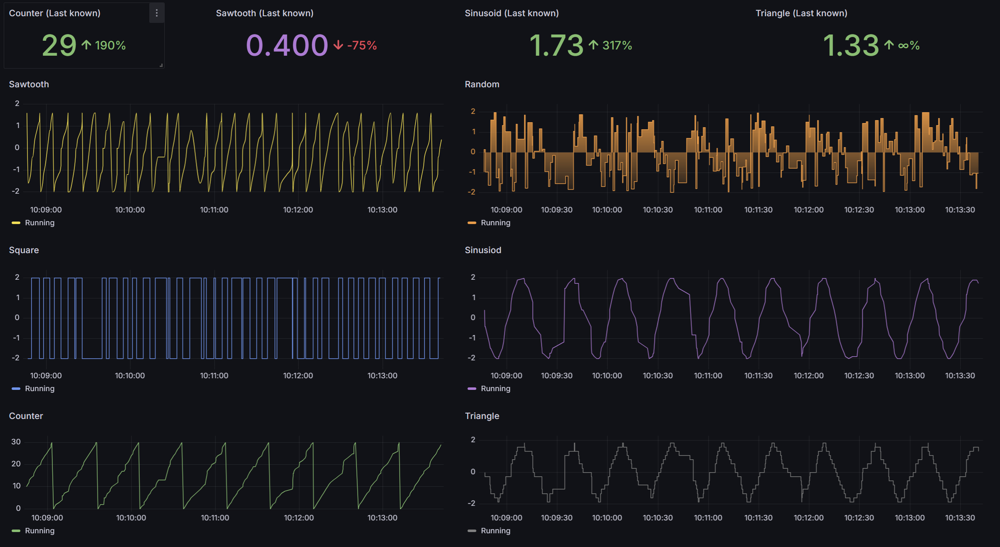
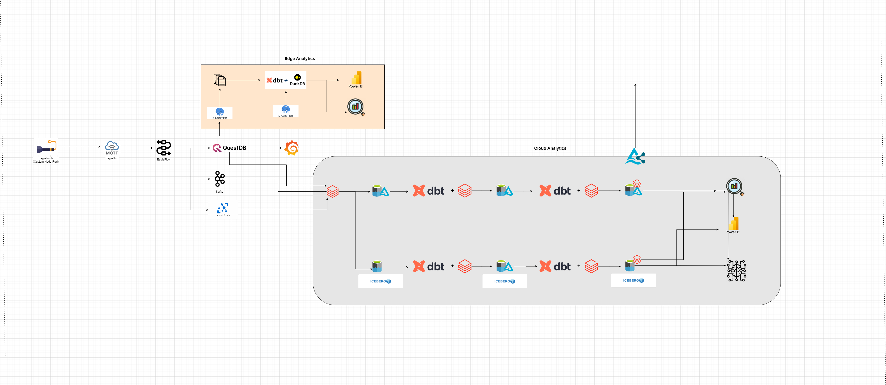

# Starter IoT docker compose files

### eagletorch is a custom Node-RED docker image that comes with pre-built sqlite database and a default admin user. There are other docker compose files that can be run to setup full IoT real time analytics.

* docker-compose -f docker-eagletorch.yml up -d

This starts a docker container with eagletorch and ready for data extraction from opcua devices. 

Url: http://localhost:8080/thing/

Credentials: admin/admin (default or supplied during container creation)

Import Node-RED flows (if you have a prosys simulation server installed) from eagletorch/flows.json

* docker-compose -f docker-emqx.yml up -d

* docker-compose -f docker-questdb.yml up -d

* docker-compose -f docker-cf-kafka.yml up -d

This starts an EMQX MQTT broker. You can choose to install other MQTT brokers

* docker-compose -f docker-grafana.yml up -d

This starts a grafana docker instance.

Make sure to install questdb plugin and import a sample dashboard from \grafana\sample-dashboard.json

* docker-compose -f docker-eagleflow.yml up -d

This starts an instance of eagleflow, consume messages from MQTT broker and can be saved to questdb (default configuration) or published to Kafka instance or Azure IoT hub. Login to the eagleflow docker container and apply all the necessary configurations to layout.toml file. 

Default MQTT setup receives connection without SSL, however layout.toml has configurations to accept MQTT connections on SSL.

### Further reference architecture for Edge and Cloud Analytics

